# MyBatis-hands-on
## 第10回課題「CRUD処理を実装」を提出
### 実装内容
#### 第9回の課題で以下を実装した。
+ "/song"で、データベースから一覧が返ってくる。
+ "/song/search?year=○○"で、発売年が入っているカラム「year」から、該当するレコードが返ってくる。
  - 該当するレコードがなかった場合は、404エラーが返される。  
#### これに追加する形で、以下のものを新たに実装。  
+ "/create"で、songsListに新しいレコードを追加する。  
  - バリデーションエラーになった場合は、400エラーが返される。  
+ "/update/{id}"で、指定したidのレコードの内容を変更  
  - 指定したidのレコードが存在しなかった場合は、404エラーが返される。  
+ "/delete/{id}"で、指定したidのレコードを削除  
  - 指定したidのレコードが存在しなかった場合は、404エラーが返される。

### 実行結果
##### ★一覧を取得（/song）

#### ★2023年発売のものを取得（/search?year=2023）
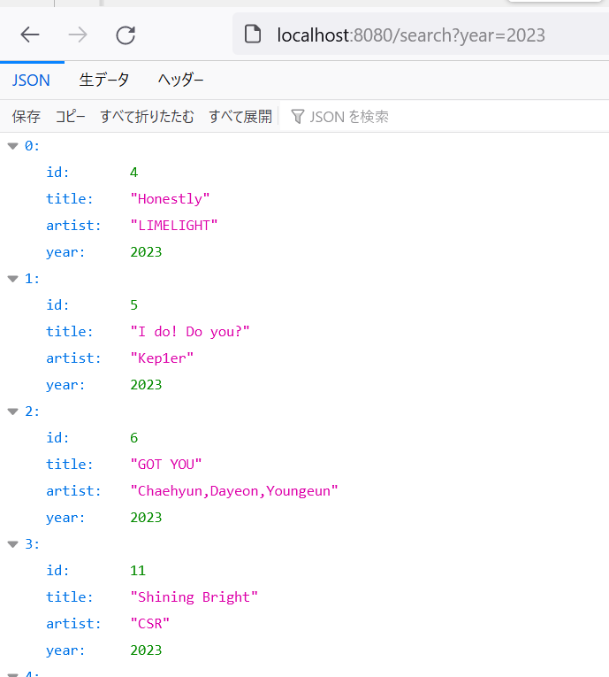
#### ★該当するレコードがない場合（/search?year=202333）
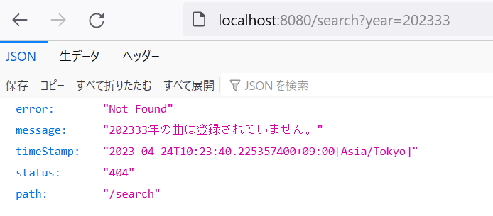
#### ★レコードの新規登録（/create）  
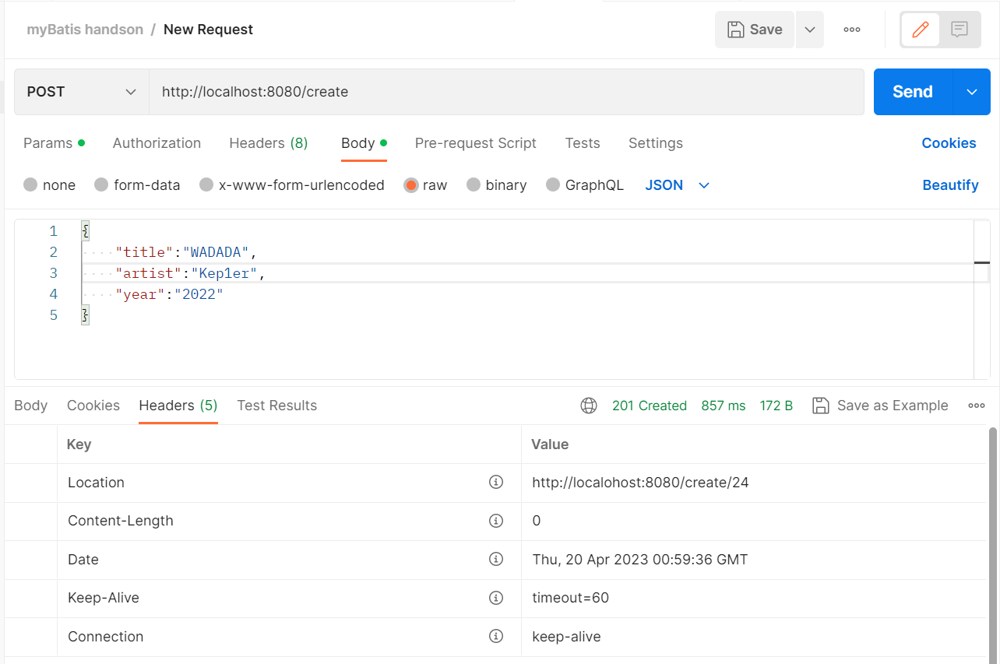  
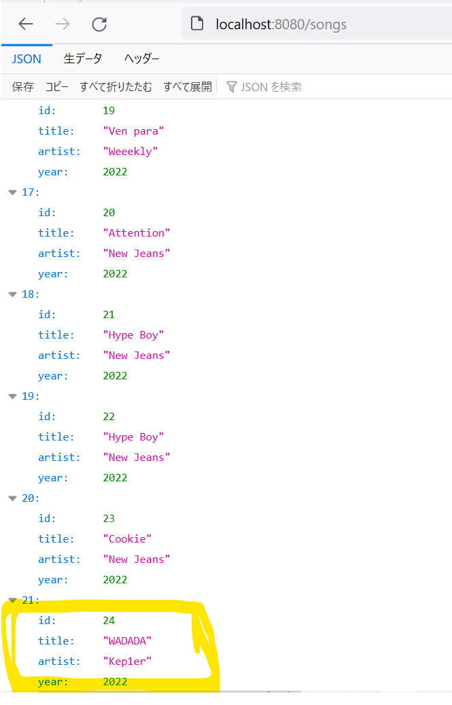
#### ★バリデーションエラー（/create）  
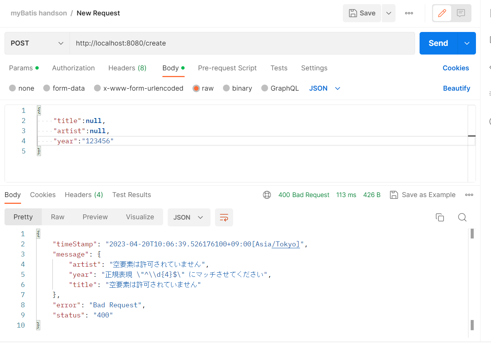  
#### ★レコードの内容を変更（/update/22）  
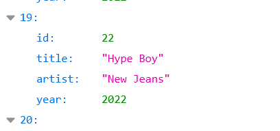  
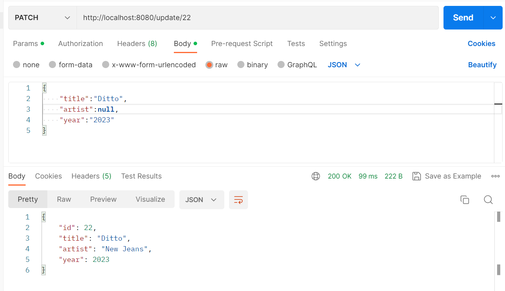  
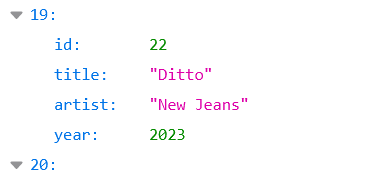  
#### ★該当するidがない場合（/update/123456）  
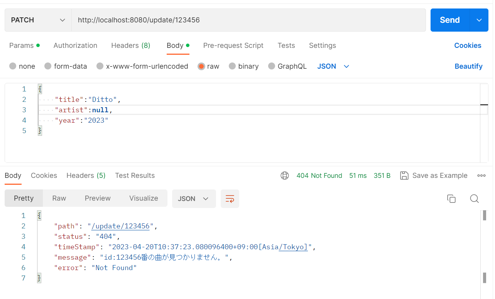
#### ★レコードを削除（/delete/1）  
  
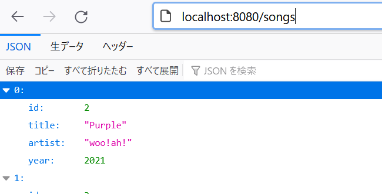
#### ★該当するidがない場合（/delete/123456）
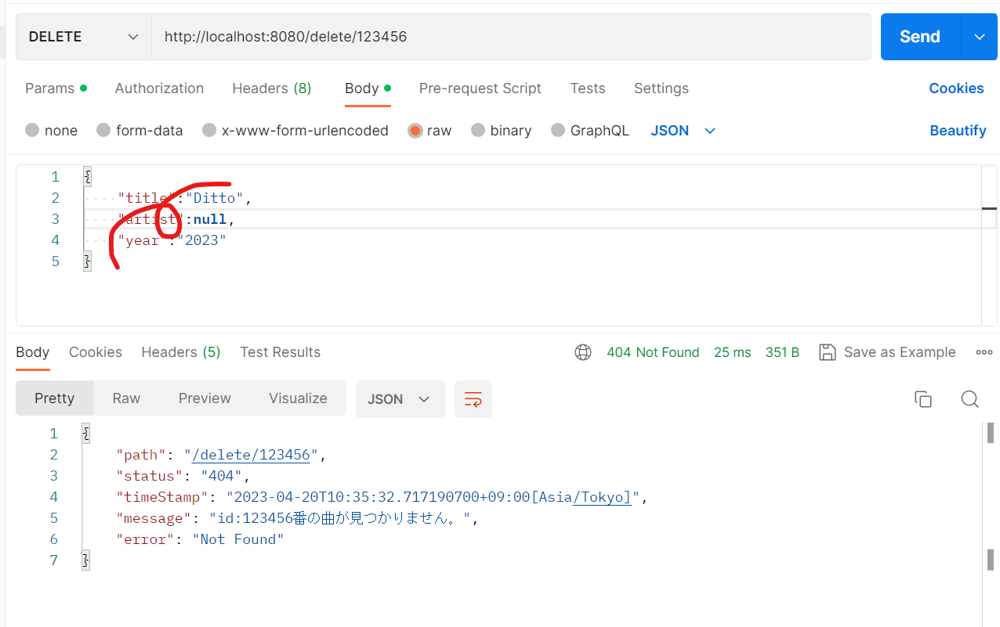  

